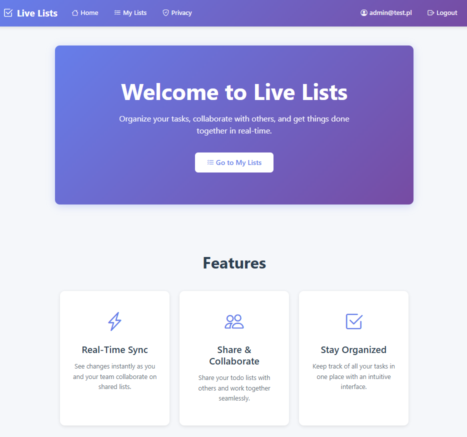
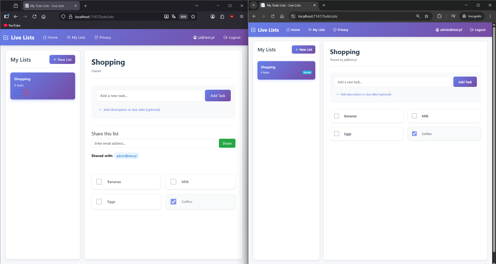
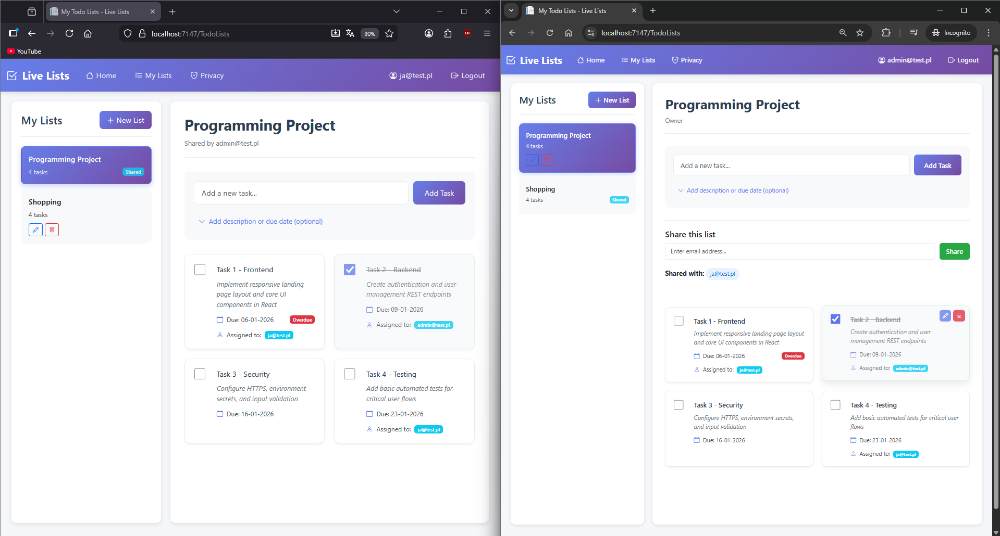

  # Live Lists To-Do App

A real-time collaborative todo list application built with ASP.NET Core, featuring live synchronization across multiple users using SignalR. Create todo lists, assign tasks to team members, and see changes instantly without page reloading.

  

## Features

- **Real-time Collaboration**: All changes sync instantly across all users sharing a list
- **User Authentication**: Secure user accounts with ASP.NET Core Identity
- **Task Management**: 
  - Create, edit, and delete tasks
  - Add descriptions and due dates
  - Mark tasks as completed
  - Assign tasks to multiple users by email
- **Live Updates**: See changes in real-time without refreshing:
  - Task additions, edits, and deletions
  - Task completion status changes
  - Description and due date updates
  - User assignments
  - List deletions

## Technologies Used

- **Backend**:
  - ASP.NET Core 10.0 (MVC)
  - Entity Framework Core 10.0
  - SQL Server Database
  - ASP.NET Core SignalR (for real-time communication)
  - ASP.NET Core Identity (for authentication)

- **Frontend**:
  - Bootstrap 5
  - JavaScript (ES6+)
  - SignalR JavaScript Client
  - Bootstrap Icons

- **Architecture**:
  - MVC Pattern
  - Repository Pattern (via DbContext)
  - SignalR Hubs for real-time messaging

## How It Works

The app uses **ASP.NET Core SignalR** to enable real-time bidirectional communication between the server and clients:

1. **Connection**: When a user opens a todo list, their browser connects to the SignalR hub
2. **Groups**: Users are added to groups based on:
   - List ID (for list-specific updates)
   - User email
3. **Broadcasting**: When any user makes a change (add/edit/delete task, toggle completion, etc.), the server broadcasts the update to all users in the relevant group
4. **Live Updates**: All connected clients receive the update instantly and update their UI without page refresh

## Examples

  

  

